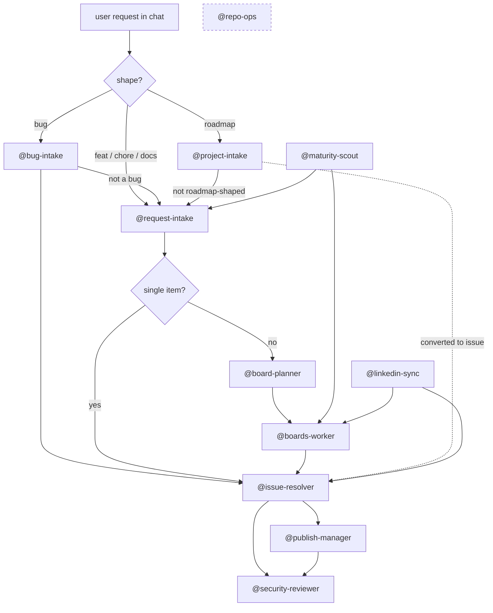

# Agents

This page catalogs the chat agents that build, maintain, and audit this portfolio repo. The user's intent: "I want the wiki to cover *how* the repo was built — including the agents and prompts that are used and how they interact."

Two flavors run side by side:

- **Local chat-mode agents** — Markdown specs under [`.github/agents/`](https://github.com/marcusjacobson/portfolio/tree/main/.github/agents) in this repo. They run inside VS Code Copilot Chat (or any Copilot client that loads `*.agent.md`). State lives in your working tree; mutations go through `git`, `gh`, and the GitHub MCP server.
- **Hosted Copilot cloud agent** — GitHub's [Copilot coding agent](https://docs.github.com/en/copilot/using-github-copilot/coding-agent), invoked by assigning an issue to `@copilot` or via the `mcp_io_github_git_assign_copilot_to_issue` MCP tool. It runs in a sandboxed cloud environment, opens its own PR, and reports back as a normal GitHub user.

Both flavors converge on the same artifacts: GitHub issues, Projects v2 boards, branches, and PRs. See [Boards](Boards) for the board topology and [Terminology](Terminology) for the Project-vs-Board distinction.

## Local agents

Frontmatter source: each row's purpose is the agent's `readme-summary:` (truncated to 2 sentences). The "When to engage" column condenses the agent's own *When to engage* section. Default handoff is the agent the file calls out as its primary downstream worker.

| Agent | Purpose | When to engage | Default handoff |
|-------|---------|----------------|------------------|
| [`@request-intake`](https://github.com/marcusjacobson/portfolio/blob/main/.github/agents/request-intake.agent.md) | Front door for any feature/chore/docs ask. Classifies the request, drafts an issue, proposes a board home, and waits for approval before filing. | Any new feature, page, visual change, refactor, or backlog idea raised in chat. | `@issue-resolver` (single item) or `@board-planner` (cluster). |
| [`@bug-intake`](https://github.com/marcusjacobson/portfolio/blob/main/.github/agents/bug-intake.agent.md) | Bug-shaped variant of intake: gathers repro steps, environment, and evidence, then routes to a bug-tracking board. | User describes broken or regressed behavior — "X is broken on mobile", a screenshot of something visibly wrong. | `@issue-resolver`; defers to `@request-intake` if the report isn't a bug. |
| [`@project-intake`](https://github.com/marcusjacobson/portfolio/blob/main/.github/agents/project-intake.agent.md) | Roadmap-shaped variant of intake: drafts a project/roadmap item and creates it directly as a DraftIssue on the Security Portfolio Roadmap (board #13) with `Status=Todo`. | User proposes a new portfolio project, capstone, or roadmap initiative. | None until the draft is converted to an issue; then `@issue-resolver`. |
| [`@issue-resolver`](https://github.com/marcusjacobson/portfolio/blob/main/.github/agents/issue-resolver.agent.md) | Resolves a single GitHub issue end-to-end: branch, implement, lint, commit, open PR, watch checks, merge. Requires an explicit issue number. | One issue is fully scoped and ready to ship. | `@security-reviewer` (PR review) or `@publish-manager` (publish flow). |
| [`@boards-worker`](https://github.com/marcusjacobson/portfolio/blob/main/.github/agents/boards-worker.agent.md) | Drains a GitHub board by picking the next eligible item and handing each one to `@issue-resolver`, updating Status as it goes. | A whole board column needs to be worked in batch. | `@issue-resolver` (one issue per loop). |
| [`@board-planner`](https://github.com/marcusjacobson/portfolio/blob/main/.github/agents/board-planner.agent.md) | Scopes and creates a GitHub board (Projects v2) from a theme or cluster of issues. Designs fields/views and seeds items via `scripts/gh/`. | A theme, milestone, or issue cluster needs structured tracking. | `@boards-worker` once the board is seeded. |
| [`@publish-manager`](https://github.com/marcusjacobson/portfolio/blob/main/.github/agents/publish-manager.agent.md) | Orchestrates a portfolio publish: local validation, branch, commit, push, PR, and check-watching. | Page changes are sitting in the working tree and need to ship. | `@security-reviewer` for the resulting PR. |
| [`@security-reviewer`](https://github.com/marcusjacobson/portfolio/blob/main/.github/agents/security-reviewer.agent.md) | Reviews a PR diff for XSS, secret leakage, supply-chain risk, unsafe workflow permissions, and CDN trust. Read-only. | Before merging any PR that touches HTML/JS, workflows, or dependencies. | None — emits a verdict (`APPROVE` / `REQUEST CHANGES` / `COMMENT`). |
| [`@maturity-scout`](https://github.com/marcusjacobson/portfolio/blob/main/.github/agents/maturity-scout.agent.md) | Scans the repo against Microsoft Learn, GitHub docs, OWASP, WCAG, and repo-hygiene best practices and surfaces gap issues onto the Portfolio Maturity board (#15). | Periodic best-practice audit, or after a major external standard updates. Also runs weekly via [`maturity-scan.yml`](https://github.com/marcusjacobson/portfolio/blob/main/.github/workflows/maturity-scan.yml). | `@request-intake` (chat triage) or `@boards-worker` (batch drain). |
| [`@linkedin-sync`](LinkedIn-Sync) | Compares portfolio claims against the user's LinkedIn profile snapshot and files `gap:*` issues for missing, stale, or misaligned items. Also runs a static best-practice checklist on every invocation. See [LinkedIn Sync](LinkedIn-Sync) for the full design. | User says "sync LinkedIn", "check profile drift", or wants to audit cert / project / skill parity between portfolio and LinkedIn. | `@issue-resolver` (single finding) or `@boards-worker` (drain the gap backlog). |
| [`@repo-ops`](https://github.com/marcusjacobson/portfolio/blob/main/.github/agents/repo-ops.agent.md) | Generic catch-all for Issues, Projects, Labels, and Wiki ops driven by `gh` CLI and the GitHub MCP server. | Ad-hoc label syncs, wiki edits, or `gh` operations that don't fit another agent. | None — terminal step. |

## How they hand off

`@repo-ops` is a side-channel for everything that doesn't fit the main flow — label syncs, wiki edits, ad-hoc `gh` commands. It can be invoked from any stage.

## Hosted vs. local

| Dimension | Local chat-mode agents | Hosted Copilot coding agent |
|-----------|------------------------|------------------------------|
| Where it runs | Your VS Code (or other Copilot client) session. | A GitHub-managed sandbox. |
| How you summon it | `@<agent-name>` in Copilot Chat, or as a chat mode. | Assign an issue to `@copilot`, or call [`mcp_io_github_git_assign_copilot_to_issue`](https://docs.github.com/en/copilot/using-github-copilot/coding-agent/about-assigning-tasks-to-copilot). |
| Source of truth | `.github/agents/*.agent.md` in this repo. | GitHub-hosted; not customizable from this repo (yet). |
| Mutates repo? | Only with explicit approval; `@issue-resolver` and `@boards-worker` mutate by design. | Yes — opens a PR on its own branch. |
| Picks up custom instructions? | Yes — reads `.github/copilot-instructions.md` plus scoped `.github/instructions/*` files. | Yes — honors `.github/copilot-instructions.md` and the same scoped instruction files. |
| Reads prompts? | Yes — slash-commands under [`.github/prompts/`](https://github.com/marcusjacobson/portfolio/tree/main/.github/prompts) are reusable from chat. | No — prompts are a chat-client feature. |
| Failure mode | Reports back in the same chat turn; nothing is filed. | Pushes a draft PR even on failure; you review or close it. |

When in doubt, prefer the local chat-mode agents — they share state with your editor, respect repo conventions on every turn, and can be paused mid-flow. Reach for the hosted agent when you want background work to happen while you're offline.

## See also

- [`.github/agents/README.md`](https://github.com/marcusjacobson/portfolio/blob/main/.github/agents/README.md) — auto-generated index synced from each agent's `readme-summary:` frontmatter via the [`/sync-agent-prompt-readmes`](https://github.com/marcusjacobson/portfolio/blob/main/.github/prompts/sync-agent-prompt-readmes.prompt.md) prompt.
- [`.github/prompts/README.md`](https://github.com/marcusjacobson/portfolio/blob/main/.github/prompts/README.md) — slash-command counterparts to these agents.
- [`.github/copilot-instructions.md`](https://github.com/marcusjacobson/portfolio/blob/main/.github/copilot-instructions.md) — repo-wide rules every agent inherits.
- [Boards](Boards) — board topology the intake and worker agents target.
- [Terminology](Terminology) — Project (portfolio) vs Board (GitHub Projects v2).
