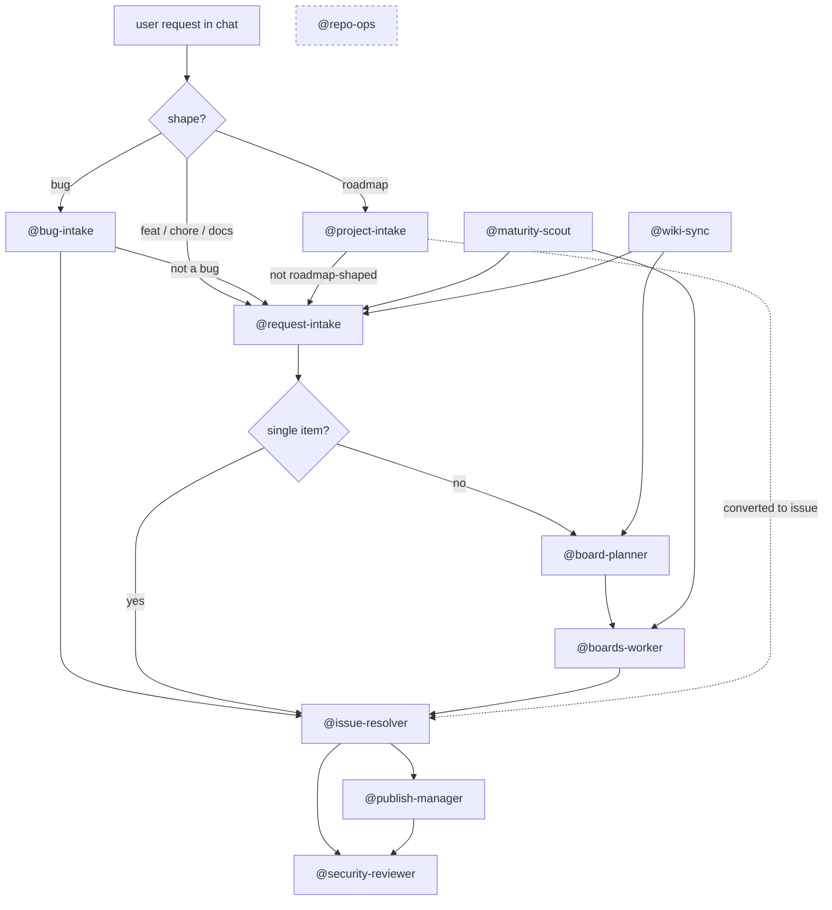

# Agents

This page catalogs the chat agents that build, maintain, and audit this portfolio repo. The user's intent: "I want the wiki to cover *how* the repo was built — including the agents and prompts that are used and how they interact."

Two flavors run side by side:

- **Local chat-mode agents** — Markdown specs under [`.github/agents/`](https://github.com/marcusjacobson/portfolio/tree/main/.github/agents) in this repo. They run inside VS Code Copilot Chat (or any Copilot client that loads `*.agent.md`). State lives in your working tree; mutations go through `git`, `gh`, and the GitHub MCP server.
- **Hosted Copilot cloud agent** — GitHub's [Copilot coding agent](https://docs.github.com/en/copilot/using-github-copilot/coding-agent), invoked by assigning an issue to `@copilot` or via the `mcp_io_github_git_assign_copilot_to_issue` MCP tool. It runs in a sandboxed cloud environment, opens its own PR, and reports back as a normal GitHub user.

Both flavors converge on the same artifacts: GitHub issues, Projects v2 boards, branches, and PRs. See [Boards](Boards) for the board topology and [Terminology](Terminology) for the Project-vs-Board distinction.

## Local chat agents

These agents live as Markdown specs under [`.github/agents/`](https://github.com/marcusjacobson/portfolio/tree/main/.github/agents) and run inside your VS Code Copilot Chat session. They share state with your editor, respect repo conventions on every turn, and can be paused mid-flow.

Frontmatter source: each row's purpose is the agent's `readme-summary:` (truncated to 2 sentences). The "When to engage" column condenses the agent's own *When to engage* section. The "Cloud mode" column mirrors the agent's frontmatter `cloud:` value: `yes` (cloud-safe with mutations), `read-only` (cloud-safe, never mutates), or `—` (not yet cloud-hardened, local-only). "Complements hosted agent?" describes how each local agent interacts with the hosted Copilot coding agent — typically by handing off background work or by reviewing the PR the hosted agent produces.

| Agent | Purpose | When to engage | Default handoff | Cloud mode | Complements hosted agent? |
|-------|---------|----------------|------------------|------------|---------------------------|
| [`@request-intake`](https://github.com/marcusjacobson/portfolio/blob/main/.github/agents/request-intake.agent.md) | Front door for any feature/chore/docs ask. Classifies the request, drafts an issue, proposes a board home, and waits for approval before filing. Also accepts JSON handoffs from upstream detectors (currently `sourceAgent: "wiki-sync"`) — auto-includes `agent:wiki-sync`, defaults to board #16, and skips re-classification while still requiring user approval. | Any new feature, page, visual change, refactor, or backlog idea raised in chat, or a handoff payload from `@wiki-sync`. | `@issue-resolver` (single item) or `@board-planner` (cluster). | `no` | Yes — produces well-scoped issues that can be assigned to `@copilot` for unattended cloud execution. |
| [`@bug-intake`](https://github.com/marcusjacobson/portfolio/blob/main/.github/agents/bug-intake.agent.md) | Bug-shaped variant of intake: gathers repro steps, environment, and evidence, then routes to a bug-tracking board. | User describes broken or regressed behavior — "X is broken on mobile", a screenshot of something visibly wrong. | `@issue-resolver`; defers to `@request-intake` if the report isn't a bug. | `no` | Yes — well-formed bug issues are good cloud-agent candidates when the repro is file-scoped. |
| [`@project-intake`](https://github.com/marcusjacobson/portfolio/blob/main/.github/agents/project-intake.agent.md) | Roadmap-shaped variant of intake: drafts a project/roadmap item and creates it directly as a DraftIssue on the Security Portfolio Roadmap (board #13) with `Status=Todo`. | User proposes a new portfolio project, capstone, or roadmap initiative. | None until the draft is converted to an issue; then `@issue-resolver`. | `no` | No — drafts stay on the roadmap until a human converts them; cloud agent isn't engaged at the draft stage. |
| [`@issue-resolver`](https://github.com/marcusjacobson/portfolio/blob/main/.github/agents/issue-resolver.agent.md) | Resolves a single GitHub issue end-to-end: branch, implement, lint, commit, open PR, watch checks, merge. Requires an explicit issue number. | One issue is fully scoped and ready to ship. | `@security-reviewer` (PR review) or `@publish-manager` (publish flow). | `yes` | Alternative — same job as the hosted agent, but synchronous and human-in-the-loop. Pick local for orchestration-heavy issues, hosted for one-shot file edits. |
| [`@boards-worker`](https://github.com/marcusjacobson/portfolio/blob/main/.github/agents/boards-worker.agent.md) | Drains a GitHub board by picking the next eligible item and handing each one to `@issue-resolver`, updating Status as it goes. | A whole board column needs to be worked in batch. | `@issue-resolver` (one issue per loop). | `yes` (fail-stop) | Partial — can hand individual items off to the hosted agent via `mcp_io_github_git_assign_copilot_to_issue` when the issue is small and self-contained. |
| [`@board-planner`](https://github.com/marcusjacobson/portfolio/blob/main/.github/agents/board-planner.agent.md) | Scopes and creates a GitHub board (Projects v2) from a theme or cluster of issues. Designs fields/views and seeds items via `scripts/gh/`. Also runs a **wiki-sync batch sweep** mode that takes a handed-off issue list from `@wiki-sync` and routes each item onto board #16 (or #15 for cross-tagged maturity items) with a diff-block preview before any mutation. | A theme, milestone, or issue cluster needs structured tracking, or `@wiki-sync` has filed a batch that needs board placement. | `@boards-worker` once the board is seeded. | `no` | No — board creation requires interactive design decisions that don't fit the hosted agent's one-shot model. |
| [`@publish-manager`](https://github.com/marcusjacobson/portfolio/blob/main/.github/agents/publish-manager.agent.md) | Orchestrates a portfolio publish: local validation, branch, commit, push, PR, and check-watching. | Page changes are sitting in the working tree and need to ship. | `@security-reviewer` for the resulting PR. | `no` | No — publishing depends on uncommitted local changes, which the hosted agent cannot see. |
| [`@security-reviewer`](https://github.com/marcusjacobson/portfolio/blob/main/.github/agents/security-reviewer.agent.md) | Reviews a PR diff for XSS, secret leakage, supply-chain risk, unsafe workflow permissions, and CDN trust. Read-only. | Before merging any PR that touches HTML/JS, workflows, or dependencies. | None — emits a verdict (`APPROVE` / `REQUEST CHANGES` / `COMMENT`). | `read-only` | Yes — runs against PRs the hosted agent opens, providing the human-side review the cloud agent's PRs need before merge. |
| [`@maturity-scout`](https://github.com/marcusjacobson/portfolio/blob/main/.github/agents/maturity-scout.agent.md) | Scans the repo against Microsoft Learn, GitHub docs, OWASP, WCAG, and repo-hygiene best practices and surfaces gap issues onto the Portfolio Maturity board (#15). | Periodic best-practice audit, or after a major external standard updates. Also runs weekly via [`maturity-scan.yml`](https://github.com/marcusjacobson/portfolio/blob/main/.github/workflows/maturity-scan.yml). | `@request-intake` (chat triage) or `@boards-worker` (batch drain). | `no` | Yes — gap issues it files are often well-scoped enough to assign straight to the hosted agent. |
| [`@wiki-sync`](https://github.com/marcusjacobson/portfolio/blob/main/.github/agents/wiki-sync.agent.md) | Detects drift between repo state (workflows, agents, prompts, scripts, structural `.github/` changes) and `wiki/*.md` since the last processed SHA, then routes each delta through `@request-intake` (issue draft) and `@board-planner` (sweep onto board #16). Detector-only: never edits `wiki/*.md`, never files issues, and never advances the state cursor unless the entire batch resolves. | User asks "run wiki-sync", "what's drifted in the wiki?", or "check the wiki against the repo" — typically via the [`/wiki-sync-run`](https://github.com/marcusjacobson/portfolio/blob/main/.github/prompts/wiki-sync-run.prompt.md) prompt. | `@request-intake` (per delta) then `@board-planner` (batch sweep). | `no` | No — requires interactive batch confirmation; never advances the cursor unattended. |
| [`@triage`](https://github.com/marcusjacobson/portfolio/blob/main/.github/agents/triage.agent.md) | Triages issues currently labeled `needs-triage` — confirms them for work (labels + priority + board placement) or dismisses them (close as wontfix/duplicate). Operates one issue at a time in local Copilot Chat. | The `needs-triage` queue has open items, or a maturity-scout / external-scanner issue lands and needs disposition. | `@issue-resolver` (single confirmed item) or `@boards-worker` (batch drain after confirmations). | `yes` | No — chat-only. |
| [`@repo-ops`](https://github.com/marcusjacobson/portfolio/blob/main/.github/agents/repo-ops.agent.md) | Generic catch-all for Issues, Projects, Labels, and Wiki ops driven by `gh` CLI and the GitHub MCP server. | Ad-hoc label syncs, wiki edits, or `gh` operations that don't fit another agent. | None — terminal step. | `no` | No — `gh`/MCP plumbing is local-only; the hosted agent doesn't operate at this layer. |
| [`@repo-cleanup`](https://github.com/marcusjacobson/portfolio/blob/main/.github/agents/repo-cleanup.agent.md) | Sweeps the repo for incidental work artefacts and proposes them for removal one at a time. Read-only until per-item approval; `keep` writes a remediation (`.gitignore`, `.cleanupignore`, or in-file marker) so the same item isn't re-flagged. | Periodic hygiene sweep, after long Copilot sessions, or when `staging-inbox/` / `test-results/` / `playwright-report/` has accumulated. | None — terminal step; user commits any remediation diffs manually. | `no` | No — local-only file scan and remediation; the hosted agent doesn't see uncommitted state. |

## How they hand off

`@repo-ops` is a side-channel for everything that doesn't fit the main flow — label syncs, wiki edits, ad-hoc `gh` commands. It can be invoked from any stage.

## Hosted cloud agent

The **GitHub Copilot coding agent** (the hosted cloud agent) is a single, GitHub-managed worker that runs in a sandboxed cloud environment, opens its own PR, and reports back as a normal GitHub user. Unlike the local agents above, it isn't defined by a Markdown spec in this repo — its behavior is configured by GitHub, and it inherits this repo's `.github/copilot-instructions.md` and scoped `.github/instructions/*` files at runtime.

It has two summon paths:

- **Assign an issue to `@copilot`** in the GitHub UI (Issues → Assignees → `@copilot`). The agent picks up the issue body, branches, implements, opens a draft PR, and posts updates as comments.
- **Call [`mcp_io_github_git_assign_copilot_to_issue`](https://docs.github.com/en/copilot/using-github-copilot/coding-agent/about-assigning-tasks-to-copilot)** from any local agent that has the GitHub MCP server available. This is how `@boards-worker` and `@maturity-scout` can offload self-contained items without a human in the loop.

The hosted agent is best at **file-scoped, one-shot tasks**: a typo fix, a single-page content tweak, a small refactor with a clear acceptance test. It is weakest at orchestration (multi-step board drains, cross-cutting refactors, anything that needs interactive design decisions) and at anything that depends on uncommitted local working-tree state.

### Cloud-agent contract — `AGENTS.md`

The hosted agent reads [`AGENTS.md`](https://github.com/marcusjacobson/portfolio/blob/main/AGENTS.md) at the repo root on every run (per [GitHub's docs](https://docs.github.com/en/copilot/tutorials/cloud-agent/get-the-best-results#adding-custom-instructions-to-your-repository)). That file is the **only** place the cloud agent's behavior is configured from this repo, and it carries a single rule: **any assigned issue → resolver flow** (branch, implement, lint, commit, one PR per issue).

Triage is explicitly **out of scope** for the cloud agent. If a maintainer wants the cloud agent to take a `needs-triage` issue, they triage it first in local chat (which removes `needs-triage` and adds the appropriate routing label), then assign `@copilot`. The cloud agent does not load `.github/agents/*.agent.md` files at runtime.

A budget rule also applies: roughly one premium request per task; the agent must not retry the same approach more than twice. If the second attempt fails, it posts a blocker comment and hands the issue back to the maintainer.

### Local vs. hosted at a glance

| Dimension | Local chat-mode agents | Hosted Copilot coding agent |
|-----------|------------------------|------------------------------|
| Where it runs | Your VS Code (or other Copilot client) session. | A GitHub-managed sandbox. |
| How you summon it | `@<agent-name>` in Copilot Chat, or as a chat mode. | Assign an issue to `@copilot`, or call [`mcp_io_github_git_assign_copilot_to_issue`](https://docs.github.com/en/copilot/using-github-copilot/coding-agent/about-assigning-tasks-to-copilot). |
| Source of truth | `.github/agents/*.agent.md` in this repo. | GitHub-hosted; not customizable from this repo (yet). |
| Mutates repo? | Only with explicit approval; `@issue-resolver` and `@boards-worker` mutate by design. | Yes — opens a PR on its own branch. |
| Picks up custom instructions? | Yes — reads `.github/copilot-instructions.md` plus scoped `.github/instructions/*` files. | Yes — honors `.github/copilot-instructions.md` and the same scoped instruction files. |
| Reads prompts? | Yes — slash-commands under [`.github/prompts/`](https://github.com/marcusjacobson/portfolio/tree/main/.github/prompts) are reusable from chat. | No — prompts are a chat-client feature. |
| Sees uncommitted working-tree changes? | Yes — operates on your local files. | No — only sees what's pushed. |
| Failure mode | Reports back in the same chat turn; nothing is filed. | Pushes a draft PR even on failure; you review or close it. |

### Decision guide: local or hosted?

Use the table below to decide which surface to reach for. The short version: **local for orchestration and human-in-the-loop work; hosted for file-scoped, one-shot tasks you want to run in the background.**

| If the task is… | Reach for | Why |
|------------------|-----------|-----|
| A single, well-scoped issue with a clear file target (typo, content tweak, small refactor) | Hosted (`@copilot`) | Background execution; no editor lock-up; PR appears when done. |
| Multi-step orchestration across boards, branches, or PRs | Local (`@boards-worker`, `@board-planner`) | Needs synchronous control flow and approval gates the hosted agent doesn't expose. |
| Anything that depends on uncommitted local changes (publish flow, in-progress page edits) | Local (`@publish-manager`, `@issue-resolver`) | Hosted agent only sees pushed state. |
| PR review / security audit | Local (`@security-reviewer`) | Read-only review with repo-specific rules; not a hosted-agent capability. |
| Triage / intake (turning a chat ask into an issue) | Local (`@request-intake`, `@bug-intake`, `@project-intake`) | Interactive classification, dedupe checks, and approval before any mutation. |
| Periodic audit (best-practice scan) | Local (`@maturity-scout`) | Multi-source comparison and batch issue filing; gap issues can then be handed off to hosted. |
| Background work while you're offline / AFK | Hosted (`@copilot`) | Runs in GitHub's sandbox; doesn't need your machine awake. |
| Ad-hoc `gh` / MCP plumbing (label sync, wiki edit) | Local (`@repo-ops`) | Hosted agent doesn't operate at the CLI/MCP layer. |

When in doubt, prefer the local chat-mode agents — they share state with your editor, respect repo conventions on every turn, and can be paused mid-flow. Reach for the hosted agent when a task is small, self-contained, and you want it to happen in the background.

## See also

- [`AGENTS.md`](https://github.com/marcusjacobson/portfolio/blob/main/AGENTS.md) — cloud-agent contract loaded by the hosted Copilot cloud agent on every run.
- [`.github/agents/README.md`](https://github.com/marcusjacobson/portfolio/blob/main/.github/agents/README.md) — auto-generated index synced from each agent's `readme-summary:` frontmatter via the [`/sync-agent-prompt-readmes`](https://github.com/marcusjacobson/portfolio/blob/main/.github/prompts/sync-agent-prompt-readmes.prompt.md) prompt.
- [`.github/prompts/README.md`](https://github.com/marcusjacobson/portfolio/blob/main/.github/prompts/README.md) — slash-command counterparts to these agents.
- [`.github/copilot-instructions.md`](https://github.com/marcusjacobson/portfolio/blob/main/.github/copilot-instructions.md) — repo-wide rules every agent inherits.
- [Boards](Boards) — board topology the intake and worker agents target.
- [Terminology](Terminology) — Project (portfolio) vs Board (GitHub Projects v2).
